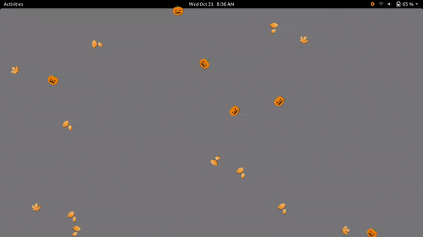

# DownFall
DownFall is a GNOME Shell extension that moves text items of your choice across the screen  

DownFall is inspired by projects like [Xsnow](https://janswaal.home.xs4all.nl/Xsnow/), [gsnow](https://extensions.gnome.org/extension/1156/gsnow/), and [Let it snow](https://bitbucket.org/matban/let-it-snow), but with support for arbitrary text or Unicode emojis

Text items can fall in eight directions on either the primary or current monitor:  
* Down (↓)
* Up (↑)
* Right (→)
* Left (←)
* Up-right (↗)
* Up-left (↖)
* Down-right (↘)
* Down-left (↙)

Additional configuration options include color, font, size, fall speed/time, rotation, and drift

DownFall can be used to render multiple effects such as:  
* Snow (❄, ❅, ❆, *, .)
* Leaves (🍁️, 🍂️) falling or breezing across the screen
* Japanese cherry blossoms (🌸️)
* The opening crawls from Star Wars®
* Fireworks
* Digital rain from The Matrix® series (forthcoming)
